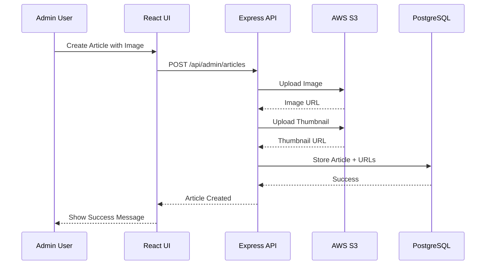

# Design Document: Admin Content Management System

## Overview

The Admin Content Management System provides a comprehensive interface for managing all platform content. The system is built as an extension to the existing admin infrastructure, adding new routes, components, and services for content and file management. The architecture follows a three-tier pattern: React frontend components, Express API routes, and PostgreSQL database with AWS S3 for file storage.

The system handles five content types (Articles, Events, Resources, Shows, Episodes) with a unified management interface pattern. File uploads are processed through a dedicated upload service that handles validation, S3 storage, and thumbnail generation for images.

## Architecture

### High-Level Architecture

```
┌─────────────────────────────────────────────────────────────┐
│                     React Frontend                          │
│  ┌──────────────┐  ┌──────────────┐  ┌──────────────┐     │
│  │ Admin Pages  │  │  Components  │  │ Rich Editor  │     │
│  └──────────────┘  └──────────────┘  └──────────────┘     │
└─────────────────────────────────────────────────────────────┘
                            │
                    ┌───────▼────────┐
                    │   API Client   │
                    └───────┬────────┘
                            │
┌─────────────────────────────────────────────────────────────┐
│                   Express Backend                           │
│  ┌──────────────┐  ┌──────────────┐  ┌──────────────┐     │
│  │ Admin Routes │  │  Middleware  │  │   Services   │     │
│  └──────────────┘  └──────────────┘  └──────────────┘     │
└─────────────────────────────────────────────────────────────┘
                            │
              ┌─────────────┴─────────────┐
              │                           │
    ┌─────────▼────────┐      ┌──────────▼─────────┐
    │   PostgreSQL     │      │      AWS S3        │
    │    Database      │      │   File Storage     │
    └──────────────────┘      └────────────────────┘
```

### Component Interaction Flow



## Components and Interfaces

### Backend Components

#### 1. Admin Content Routes

**Articles Route** (`/api/admin/articles`)
```typescript
interface ArticleCreateRequest {
  title: string;
  content: string;
  author: string;
  imageUrl?: string;
  published: boolean;
}

interface ArticleUpdateRequest {
  title?: string;
  content?: string;
  imageUrl?: string;
  published?: boolean;
}

interface ArticleResponse {
  id: number;
  title: string;
  content: string;
  author: string;
  imageUrl: string | null;
  published: boolean;
  createdAt: string;
  updatedAt: string;
}
```

**Events Route** (`/api/admin/events`)
```typescript
interface EventCreateRequest {
  title: string;
  description: string;
  eventDate: string; // ISO 8601 format
  location: string;
  imageUrl?: string;
}

interface EventResponse {
  id: number;
  title: string;
  description: string;
  eventDate: string;
  location: string;
  imageUrl: string | null;
  createdAt: string;
  updatedAt: string;
}
```

**Resources Route** (`/api/admin/resources`)
```typescript
interface ResourceCreateRequest {
  title: string;
  description: string;
  fileUrl: string;
  fileType: string;
  fileSize: number;
}

interface ResourceResponse {
  id: number;
  title: string;
  description: string;
  fileUrl: string;
  fileType: string;
  fileSize: number;
  createdAt: string;
  updatedAt: string;
}
```

**Episodes Route** (`/api/admin/episodes`)
```typescript
interface EpisodeCreateRequest {
  showId: number;
  title: string;
  description: string;
  audioUrl: string;
  duration: number; // in seconds
  publishedAt?: string;
}

interface EpisodeResponse {
  id: number;
  showId: number;
  title: string;
  description: string;
  audioUrl: string;
  duration: number;
  publishedAt: string;
  createdAt: string;
  updatedAt: string;
}
```

#### 2. File Upload Service

**Upload Service** (`backend/src/services/upload.ts`)
```typescript
interface UploadOptions {
  fileType: 'image' | 'document' | 'audio';
  generateThumbnail?: boolean;
  maxSize?: number; // in bytes
}

interface UploadResult {
  url: string;
  thumbnailUrl?: string;
  fileSize: number;
  mimeType: string;
}

class UploadService {
  async uploadFile(
    file: Buffer,
    filename: string,
    options: UploadOptions
  ): Promise<UploadResult>;
  
  async generateThumbnail(
    imageBuffer: Buffer,
    maxWidth: number,
    maxHeight: number
  ): Promise<Buffer>;
  
  async deleteFile(fileUrl: string): Promise<void>;
  
  validateFileType(mimeType: string, allowedTypes: string[]): boolean;
  validateFileSize(size: number, maxSize: number): boolean;
}
```

#### 3. Content Validation Middleware

```typescript
interface ValidationRule {
  field: string;
  required?: boolean;
  type?: 'string' | 'number' | 'boolean' | 'date';
  maxLength?: number;
  minLength?: number;
  pattern?: RegExp;
}

function validateContent(rules: ValidationRule[]) {
  return (req: Request, res: Response, next: NextFunction) => {
    // Validation logic
  };
}
```

### Frontend Components

#### 1. Content Management Pages

**AdminArticlesPage**
- List view with search, filter, sort
- Create/Edit modal with rich text editor
- Bulk actions (publish, unpublish, delete)
- Image upload with preview

**AdminEventsPage**
- Calendar view and list view toggle
- Date/time picker for event scheduling
- Location autocomplete
- Image upload

**AdminResourcesPage**
- File upload with progress indicator
- File type icons and size display
- Download preview
- Bulk delete

**AdminEpisodesPage**
- Show selector dropdown
- Audio upload with waveform preview
- Duration auto-detection
- Publish scheduling

#### 2. Shared Components

**ContentTable Component**
```typescript
interface ContentTableProps<T> {
  data: T[];
  columns: ColumnDefinition<T>[];
  onEdit: (item: T) => void;
  onDelete: (item: T) => void;
  onBulkAction: (action: string, items: T[]) => void;
  searchable?: boolean;
  filterable?: boolean;
  sortable?: boolean;
}
```

**FileUploader Component**
```typescript
interface FileUploaderProps {
  accept: string; // MIME types
  maxSize: number;
  multiple?: boolean;
  onUploadComplete: (result: UploadResult) => void;
  onUploadError: (error: Error) => void;
  generateThumbnail?: boolean;
}
```

**RichTextEditor Component**
```typescript
interface RichTextEditorProps {
  value: string;
  onChange: (html: string) => void;
  placeholder?: string;
  toolbar?: ToolbarOption[];
  onImageUpload?: (file: File) => Promise<string>;
}
```

**ContentModal Component**
```typescript
interface ContentModalProps {
  isOpen: boolean;
  onClose: () => void;
  onSave: (data: any) => Promise<void>;
  title: string;
  initialData?: any;
  fields: FieldDefinition[];
}
```

## Data Models

### Database Schema Extensions

**Articles Table**
```sql
CREATE TABLE articles (
  id SERIAL PRIMARY KEY,
  title VARCHAR(255) NOT NULL,
  content TEXT NOT NULL,
  author VARCHAR(255) NOT NULL,
  image_url VARCHAR(500),
  thumbnail_url VARCHAR(500),
  published BOOLEAN DEFAULT false,
  created_at TIMESTAMP DEFAULT CURRENT_TIMESTAMP,
  updated_at TIMESTAMP DEFAULT CURRENT_TIMESTAMP
);

CREATE INDEX idx_articles_published ON articles(published);
CREATE INDEX idx_articles_created_at ON articles(created_at DESC);
```

**Events Table**
```sql
CREATE TABLE events (
  id SERIAL PRIMARY KEY,
  title VARCHAR(255) NOT NULL,
  description TEXT NOT NULL,
  event_date TIMESTAMP NOT NULL,
  location VARCHAR(255) NOT NULL,
  image_url VARCHAR(500),
  thumbnail_url VARCHAR(500),
  created_at TIMESTAMP DEFAULT CURRENT_TIMESTAMP,
  updated_at TIMESTAMP DEFAULT CURRENT_TIMESTAMP
);

CREATE INDEX idx_events_date ON events(event_date);
```

**Resources Table**
```sql
CREATE TABLE resources (
  id SERIAL PRIMARY KEY,
  title VARCHAR(255) NOT NULL,
  description TEXT NOT NULL,
  file_url VARCHAR(500) NOT NULL,
  file_type VARCHAR(50) NOT NULL,
  file_size INTEGER NOT NULL,
  created_at TIMESTAMP DEFAULT CURRENT_TIMESTAMP,
  updated_at TIMESTAMP DEFAULT CURRENT_TIMESTAMP
);
```

**Episodes Table Enhancement**
```sql
-- Assuming episodes table exists, add missing columns
ALTER TABLE episodes ADD COLUMN IF NOT EXISTS audio_url VARCHAR(500);
ALTER TABLE episodes ADD COLUMN IF NOT EXISTS duration INTEGER;
ALTER TABLE episodes ADD COLUMN IF NOT EXISTS published_at TIMESTAMP;

CREATE INDEX idx_episodes_show_id ON episodes(show_id);
CREATE INDEX idx_episodes_published_at ON episodes(published_at DESC);
```

### S3 Storage Structure

```
advocacy-platform-media/
├── articles/
│   ├── images/
│   │   ├── original/
│   │   │   └── {uuid}.jpg
│   │   └── thumbnails/
│   │       └── {uuid}_thumb.jpg
├── events/
│   ├── images/
│   │   ├── original/
│   │   └── thumbnails/
├── resources/
│   ├── documents/
│   │   └── {uuid}.pdf
├── shows/
│   ├── covers/
│   │   ├── original/
│   │   └── thumbnails/
└── episodes/
    ├── audio/
    │   └── {uuid}.mp3
```

## Correctness Properties

*A property is a characteristic or behavior that should hold true across all valid executions of a system—essentially, a formal statement about what the system should do. Properties serve as the bridge between human-readable specifications and machine-verifiable correctness guarantees.*


### Core Content Management Properties

Property 1: Content Creation Persistence
*For any* valid content entity (Article, Event, Resource, Show, Episode) with all required fields, creating the content should result in it being stored in the database with a unique ID and all provided fields preserved.
**Validates: Requirements 1.1, 2.1, 3.1, 4.1, 5.1**

Property 2: Content Update Preserves Creation Metadata
*For any* existing content entity and any valid update, updating the content should preserve the original creation timestamp and ID while updating only the specified fields.
**Validates: Requirements 1.2, 2.2, 4.3, 5.6**

Property 3: Content Deletion with File Cleanup
*For any* content entity with associated files in S3, deleting the content should remove both the database record and all associated files from S3 storage.
**Validates: Requirements 1.3, 3.4, 5.5**

Property 4: Publication Status Transitions
*For any* article, toggling between published and unpublished states should correctly update the publication status field, and publishing should record a publication timestamp.
**Validates: Requirements 1.4, 1.5**

### Search and Filtering Properties

Property 5: Keyword Search Completeness
*For any* search query and content collection, all returned results should contain the search keyword in either the title or description field, and no matching items should be omitted.
**Validates: Requirements 1.7, 8.2**

Property 6: Status Filter Correctness
*For any* publication status filter and content collection, all returned results should have exactly that publication status, and no items with that status should be omitted.
**Validates: Requirements 1.8, 8.3**

Property 7: Date Range Filter Correctness
*For any* date range filter and event collection, all returned events should have event dates within the specified range (inclusive), and no events within the range should be omitted.
**Validates: Requirements 2.6**

Property 8: Sorting Consistency
*For any* content collection and sort column, sorting by that column in ascending order should produce a list where each item's sort value is less than or equal to the next item's value, and descending order should produce the reverse.
**Validates: Requirements 2.5, 5.7, 8.4**

### File Upload and Processing Properties

Property 9: File Type Validation
*For any* file upload with a specified allowed type list, files with MIME types not in the allowed list should be rejected with an error, and files with allowed types should be accepted.
**Validates: Requirements 3.2, 5.2, 6.1, 10.3**

Property 10: File Upload Persistence
*For any* successfully uploaded file, the upload should return a valid S3 URL that is publicly accessible and serves the correct file content.
**Validates: Requirements 2.4, 5.4, 6.5**

Property 11: Thumbnail Generation and Storage
*For any* uploaded image file, the system should generate a thumbnail with maximum dimensions of 300x300 pixels while preserving aspect ratio, and store both the original and thumbnail in S3 with accessible URLs.
**Validates: Requirements 4.2, 6.4, 11.2, 11.3, 11.4**

Property 12: Sequential Multi-File Processing
*For any* batch of multiple files uploaded together, the files should be processed sequentially in the order they were provided, with each upload completing before the next begins.
**Validates: Requirements 6.6**

Property 13: Thumbnail Generation Fallback
*For any* image upload where thumbnail generation fails, the system should log the error and use the original image URL as the thumbnail URL, ensuring the upload still succeeds.
**Validates: Requirements 11.5**

### Security and Validation Properties

Property 14: HTML Sanitization
*For any* HTML content submitted through the rich text editor, all script tags, event handler attributes (onclick, onerror, etc.), and javascript: URLs should be removed from the stored HTML.
**Validates: Requirements 7.4, 10.4**

Property 15: HTML Content Persistence
*For any* valid HTML content saved through the editor, retrieving the content should return HTML that is semantically equivalent to what was saved (after sanitization).
**Validates: Requirements 7.6**

Property 16: Authentication Enforcement
*For any* admin API endpoint, requests without a valid JWT token should be rejected with a 401 Unauthorized error, and requests with expired tokens should also be rejected.
**Validates: Requirements 10.1, 10.5, 10.6**

Property 17: Authorization Enforcement
*For any* admin API endpoint, requests from authenticated users without admin role should be rejected with a 403 Forbidden error.
**Validates: Requirements 10.2, 10.5**

Property 18: Required Field Validation
*For any* content creation or update request missing required fields (title for all types, content for articles, date for events, file for resources, audio for episodes), the request should be rejected with a validation error listing the missing fields.
**Validates: Requirements 12.1, 12.2, 12.3, 12.4, 12.5**

### Data Integrity Properties

Property 19: Referential Integrity Protection
*For any* show with one or more associated episodes, attempting to delete the show should be rejected with an error indicating that episodes must be deleted first.
**Validates: Requirements 4.4**

Property 20: List Completeness
*For any* content list request, the response should include all required fields for that content type (title, status, dates, file metadata as applicable) for every item in the list.
**Validates: Requirements 1.6, 3.6, 4.5**

Property 21: Pagination Consistency
*For any* content collection with more than 20 items, requesting page N should return items (N-1)*20 + 1 through N*20, with no items duplicated across pages and no items omitted.
**Validates: Requirements 8.1**

Property 22: Bulk Action Atomicity
*For any* bulk action (delete, publish, unpublish) applied to a set of selected items, either all items should be successfully updated or none should be updated if any individual operation fails.
**Validates: Requirements 8.5, 8.6**

### Frontend Display Properties

Property 23: Published Content Visibility
*For any* public-facing content list (articles, events, resources), only items with published status (or future event dates for events) should be visible to non-admin users.
**Validates: Requirements 9.1, 9.3**

Property 24: Resource Download Accessibility
*For any* resource in the system, the download URL should be accessible and serve the correct file with appropriate content-type headers.
**Validates: Requirements 9.4, 9.5**

Property 25: Episode Audio Accessibility
*For any* published episode, the audio URL should be accessible and serve streamable audio content with appropriate content-type headers.
**Validates: Requirements 9.6, 9.7**

## Error Handling

### File Upload Errors

**Size Limit Exceeded**
- Documents > 10MB: Return 413 Payload Too Large with message "Document file size exceeds 10MB limit"
- Audio > 100MB: Return 413 Payload Too Large with message "Audio file size exceeds 100MB limit"
- Images > 5MB: Return 413 Payload Too Large with message "Image file size exceeds 5MB limit"

**Invalid File Type**
- Return 400 Bad Request with message "File type {type} is not allowed. Allowed types: {allowed_list}"

**S3 Upload Failure**
- Log error with full details (file name, size, error message)
- Return 500 Internal Server Error with message "File upload failed. Please try again."
- Implement retry logic (3 attempts with exponential backoff)

**Thumbnail Generation Failure**
- Log error with image details
- Use original image URL as fallback
- Continue with upload success

### Content Validation Errors

**Missing Required Fields**
- Return 400 Bad Request with JSON: `{ "errors": [{ "field": "title", "message": "Title is required" }] }`
- Include all validation errors in single response

**Invalid Data Format**
- Date fields: Return 400 with message "Invalid date format. Use ISO 8601 (YYYY-MM-DDTHH:mm:ss)"
- URL fields: Return 400 with message "Invalid URL format"
- Number fields: Return 400 with message "Field must be a number"

**Referential Integrity Violations**
- Show deletion with episodes: Return 409 Conflict with message "Cannot delete show with existing episodes"
- Episode with invalid show ID: Return 404 Not Found with message "Show not found"

### Authentication/Authorization Errors

**Missing Token**
- Return 401 Unauthorized with message "Authentication required"
- Include WWW-Authenticate header

**Invalid/Expired Token**
- Return 401 Unauthorized with message "Invalid or expired token"
- Frontend should redirect to login page

**Insufficient Permissions**
- Return 403 Forbidden with message "Admin access required"

### Database Errors

**Connection Failure**
- Log error with connection details
- Return 503 Service Unavailable with message "Database temporarily unavailable"
- Implement connection retry logic

**Query Timeout**
- Log slow query details
- Return 504 Gateway Timeout with message "Request timed out"
- Set query timeout to 30 seconds

**Unique Constraint Violation**
- Return 409 Conflict with message "Content with this title already exists"

### General Error Handling Strategy

1. **Error Logging**: All errors logged to Winston with context (user ID, request ID, timestamp)
2. **Error Monitoring**: Critical errors sent to Sentry for tracking
3. **User-Friendly Messages**: Never expose internal error details to clients
4. **Consistent Format**: All error responses follow format:
   ```json
   {
     "error": {
       "message": "Human-readable error message",
       "code": "ERROR_CODE",
       "details": {} // Optional additional context
     }
   }
   ```

## Testing Strategy

### Dual Testing Approach

The testing strategy employs both unit tests and property-based tests to ensure comprehensive coverage:

**Unit Tests** focus on:
- Specific examples demonstrating correct behavior
- Edge cases (empty inputs, boundary values, special characters)
- Error conditions and error message formatting
- Integration between components (API routes calling services)
- Mock external dependencies (S3, database)

**Property-Based Tests** focus on:
- Universal properties that hold for all valid inputs
- Comprehensive input coverage through randomization
- Invariants that must be maintained across operations
- Round-trip properties (create → read, upload → download)

Both approaches are complementary and necessary for production readiness.

### Property-Based Testing Configuration

**Library**: fast-check (already configured in the project)

**Test Configuration**:
- Minimum 100 iterations per property test
- Each test tagged with feature name and property number
- Tag format: `// Feature: admin-content-management, Property N: {property description}`

**Example Property Test Structure**:
```typescript
import fc from 'fast-check';

describe('Content Management Properties', () => {
  // Feature: admin-content-management, Property 1: Content Creation Persistence
  it('should persist all fields when creating content', async () => {
    await fc.assert(
      fc.asyncProperty(
        articleArbitrary(), // Generator for random articles
        async (article) => {
          const created = await createArticle(article);
          const retrieved = await getArticle(created.id);
          
          expect(retrieved.title).toBe(article.title);
          expect(retrieved.content).toBe(article.content);
          expect(retrieved.author).toBe(article.author);
        }
      ),
      { numRuns: 100 }
    );
  });
});
```

### Test Organization

**Backend Tests** (`backend/src/**/*.test.ts`):
- Route tests: Test API endpoints with various inputs
- Service tests: Test business logic in isolation
- Middleware tests: Test authentication, validation, error handling
- Integration tests: Test full request/response cycles

**Frontend Tests** (`frontend/src/**/*.test.tsx`):
- Component tests: Test UI components with React Testing Library
- Page tests: Test full page rendering and interactions
- Service tests: Test API client and error handling
- Accessibility tests: Test ARIA attributes and keyboard navigation

### Test Data Generators

Create fast-check arbitraries for all content types:

```typescript
// Article generator
const articleArbitrary = () => fc.record({
  title: fc.string({ minLength: 1, maxLength: 255 }),
  content: fc.string({ minLength: 1, maxLength: 10000 }),
  author: fc.string({ minLength: 1, maxLength: 255 }),
  imageUrl: fc.option(fc.webUrl()),
  published: fc.boolean()
});

// Event generator
const eventArbitrary = () => fc.record({
  title: fc.string({ minLength: 1, maxLength: 255 }),
  description: fc.string({ minLength: 1, maxLength: 5000 }),
  eventDate: fc.date({ min: new Date() }),
  location: fc.string({ minLength: 1, maxLength: 255 }),
  imageUrl: fc.option(fc.webUrl())
});

// File upload generator
const fileUploadArbitrary = (type: 'image' | 'document' | 'audio') => {
  const mimeTypes = {
    image: ['image/jpeg', 'image/png', 'image/gif'],
    document: ['application/pdf', 'application/msword'],
    audio: ['audio/mpeg', 'audio/wav']
  };
  
  return fc.record({
    buffer: fc.uint8Array({ minLength: 100, maxLength: 1000000 }),
    mimeType: fc.constantFrom(...mimeTypes[type]),
    filename: fc.string({ minLength: 1, maxLength: 100 })
  });
};
```

### Coverage Goals

- Unit test coverage: > 80% for all business logic
- Property test coverage: All 25 correctness properties implemented
- Integration test coverage: All API endpoints tested
- E2E test coverage: Critical user flows (create article, upload file, publish content)

### Continuous Integration

- Run all tests on every pull request
- Block merges if tests fail
- Generate coverage reports
- Run property tests with increased iterations (1000) in CI for thorough validation
