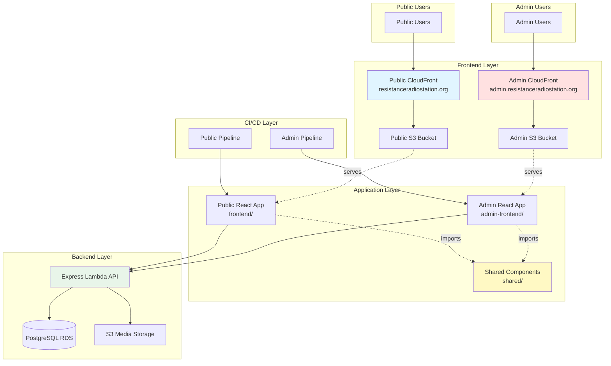

# Design Document: CMS Admin Separation

## Overview

This design document outlines the technical approach for separating the CMS admin portal from the main public-facing Zimbabwe Voice application. The current monolithic frontend architecture combines both public and admin functionality in a single React application, leading to deployment conflicts where admin changes impact the public site. This separation will create two independent frontend applications sharing a common backend API, enabling isolated deployments, improved security, and better scalability.

### Goals

1. Create two independent frontend applications (public and admin) with separate deployment pipelines
2. Maintain a single shared backend API to ensure data consistency
3. Enable independent scaling and monitoring of public and admin applications
4. Improve security through application isolation and separate security policies
5. Reduce deployment risk by isolating admin changes from public site
6. Optimize bundle sizes by removing unused code from each application

### Non-Goals

1. Modifying backend API endpoints or business logic
2. Changing admin functionality or user experience
3. Implementing new features beyond the separation itself
4. Migrating to a different technology stack

## Architecture

### High-Level Architecture



### Directory Structure

The new directory structure will organize code into three main areas:

```
advocacy-platform/
├── frontend/                    # Public-facing application
│   ├── src/
│   │   ├── components/         # Public components only
│   │   ├── pages/              # Public pages only (no Admin*)
│   │   ├── contexts/           # Public contexts
│   │   └── App.tsx             # Public routing
│   ├── dist/                   # Public build output
│   └── package.json
│
├── admin-frontend/             # NEW: Admin CMS application
│   ├── src/
│   │   ├── components/         # Admin-specific components
│   │   ├── pages/              # Admin pages (Admin*)
│   │   ├── contexts/           # Admin contexts
│   │   └── App.tsx             # Admin routing
│   ├── dist/                   # Admin build output
│   ├── package.json
│   ├── tsconfig.json
│   ├── vite.config.ts
│   └── .env.example
│
├── shared/                     # NEW: Shared code between apps
│   ├── components/             # Shared components (FileUploader, etc.)
│   ├── contexts/               # Shared contexts (AuthContext)
│   ├── services/               # Shared services (api.ts)
│   ├── utils/                  # Shared utilities
│   ├── types/                  # Shared TypeScript types
│   └── package.json
│
├── backend/                    # Unchanged backend
│   └── src/
│       ├── routes/
│       │   ├── admin/          # Admin API routes
│       │   └── ...             # Public API routes
│       └── index.ts            # CORS config updated
│
└── package.json                # Root workspace config
```

### Application Separation Strategy

#### Public Application (frontend/)

The public application will contain:
- Public-facing pages (Home, About, Shows, News, Events, Resources, Contact)
- Public components (Header, Footer, PageLayout, AudioPlayer)
- Public contexts (AudioPlayerContext, SecurityContext)
- Public routing (no /admin/* routes)

#### Admin Application (admin-frontend/)

The admin application will contain:
- Admin pages (Dashboard, Shows, Episodes, Articles, Events, Resources, Submissions, Login)
- Admin components (AdminLayout, ProtectedRoute)
- Admin contexts (AuthContext for admin authentication)
- Admin routing (all /admin/* routes)

#### Shared Library (shared/)

The shared library will contain:
- Authentication utilities (AuthContext, token management)
- API client configuration (axios setup, interceptors)
- Common components (FileUploader, ErrorBoundary, LoadingFallback)
- TypeScript types and interfaces
- Utility functions used by both apps

### Technology Stack

Both applications will use identical technology stacks:

- **Framework**: React 18 with TypeScript (strict mode)
- **Build Tool**: Vite 4.x
- **Routing**: React Router v6
- **HTTP Client**: Axios
- **State Management**: React Context API
- **Testing**: Jest + React Testing Library + fast-check
- **Linting**: ESLint with TypeScript plugin

## Components and Interfaces

### Shared Components

#### AuthContext

Provides authentication state and methods for both applications.

```typescript
// shared/contexts/AuthContext.tsx

interface User {
  id: number;
  email: string;
  role: string;
}

interface AuthContextType {
  user: User | null;
  token: string | null;
  login: (email: string, password: string) => Promise<void>;
  logout: () => void;
  isAuthenticated: boolean;
  isLoading: boolean;
}

export const AuthContext = React.createContext<AuthContextType | undefined>(undefined);

export function AuthProvider({ children }: { children: React.ReactNode }) {
  const [user, setUser] = useState<User | null>(null);
  const [token, setToken] = useState<string | null>(
    localStorage.getItem('token')
  );
  const [isLoading, setIsLoading] = useState(true);

  // Implementation details...
  
  return (
    <AuthContext.Provider value={{ user, token, login, logout, isAuthenticated, isLoading }}>
      {children}
    </AuthContext.Provider>
  );
}

export function useAuth() {
  const context = useContext(AuthContext);
  if (!context) {
    throw new Error('useAuth must be used within AuthProvider');
  }
  return context;
}
```

#### API Client

Centralized API configuration with authentication interceptors.

```typescript
// shared/services/api.ts

import axios, { AxiosInstance } from 'axios';

const API_URL = import.meta.env.VITE_API_URL || '/api';

export const createApiClient = (): AxiosInstance => {
  const client = axios.create({
    baseURL: API_URL,
    headers: {
      'Content-Type': 'application/json',
    },
    withCredentials: true,
  });

  // Request interceptor to add auth token
  client.interceptors.request.use(
    (config) => {
      const token = localStorage.getItem('token');
      if (token) {
        config.headers.Authorization = `Bearer ${token}`;
      }
      return config;
    },
    (error) => Promise.reject(error)
  );

  // Response interceptor for error handling
  client.interceptors.response.use(
    (response) => response,
    (error) => {
      if (error.response?.status === 401) {
        localStorage.removeItem('token');
        window.location.href = '/admin/login';
      }
      return Promise.reject(error);
    }
  );

  return client;
};

export const api = createApiClient();

// Typed API methods
export const showsApi = {
  getAll: () => api.get('/shows'),
  getById: (id: number) => api.get(`/shows/${id}`),
  create: (data: any) => api.post('/admin/shows', data),
  update: (id: number, data: any) => api.put(`/admin/shows/${id}`, data),
  delete: (id: number) => api.delete(`/admin/shows/${id}`),
};

// Similar exports for episodes, articles, events, resources, submissions
```

#### FileUploader Component

Shared component for file uploads used in admin forms.

```typescript
// shared/components/FileUploader.tsx

interface FileUploaderProps {
  onUpload: (url: string) => void;
  accept?: string;
  maxSize?: number;
  label?: string;
}

export default function FileUploader({
  onUpload,
  accept = 'image/*,audio/*',
  maxSize = 50 * 1024 * 1024, // 50MB
  label = 'Upload File'
}: FileUploaderProps) {
  const [uploading, setUploading] = useState(false);
  const [progress, setProgress] = useState(0);

  const handleUpload = async (file: File) => {
    if (file.size > maxSize) {
      alert(`File size exceeds ${maxSize / 1024 / 1024}MB limit`);
      return;
    }

    setUploading(true);
    const formData = new FormData();
    formData.append('file', file);

    try {
      const response = await api.post('/upload', formData, {
        headers: { 'Content-Type': 'multipart/form-data' },
        onUploadProgress: (e) => {
          setProgress(Math.round((e.loaded * 100) / (e.total || 1)));
        },
      });
      onUpload(response.data.url);
    } catch (error) {
      console.error('Upload failed:', error);
      alert('Upload failed. Please try again.');
    } finally {
      setUploading(false);
      setProgress(0);
    }
  };

  return (
    <div className="file-uploader">
      <input
        type="file"
        accept={accept}
        onChange={(e) => e.target.files?.[0] && handleUpload(e.target.files[0])}
        disabled={uploading}
      />
      {uploading && <progress value={progress} max={100} />}
    </div>
  );
}
```

### Admin Application Components

#### AdminLayout

Provides consistent layout for admin pages with navigation sidebar.

```typescript
// admin-frontend/src/components/AdminLayout.tsx

import { Link, useNavigate } from 'react-router-dom';
import { useAuth } from '../../../shared/contexts/AuthContext';

export default function AdminLayout({ children }: { children: React.ReactNode }) {
  const { user, logout } = useAuth();
  const navigate = useNavigate();

  const handleLogout = () => {
    logout();
    navigate('/admin/login');
  };

  return (
    <div className="admin-layout">
      <aside className="admin-sidebar">
        <h2>Admin CMS</h2>
        <nav>
          <Link to="/admin/dashboard">Dashboard</Link>
          <Link to="/admin/shows">Shows</Link>
          <Link to="/admin/episodes">Episodes</Link>
          <Link to="/admin/articles">Articles</Link>
          <Link to="/admin/events">Events</Link>
          <Link to="/admin/resources">Resources</Link>
          <Link to="/admin/submissions">Submissions</Link>
        </nav>
        <div className="admin-user">
          <span>{user?.email}</span>
          <button onClick={handleLogout}>Logout</button>
        </div>
      </aside>
      <main className="admin-content">
        {children}
      </main>
    </div>
  );
}
```

#### ProtectedRoute

Ensures only authenticated admin users can access admin pages.

```typescript
// admin-frontend/src/components/ProtectedRoute.tsx

import { Navigate } from 'react-router-dom';
import { useAuth } from '../../../shared/contexts/AuthContext';

export default function ProtectedRoute({ children }: { children: React.ReactNode }) {
  const { isAuthenticated, isLoading } = useAuth();

  if (isLoading) {
    return <div>Loading...</div>;
  }

  if (!isAuthenticated) {
    return <Navigate to="/admin/login" replace />;
  }

  return <>{children}</>;
}
```

### Public Application Components

The public application retains existing components:
- Header, Footer, PageLayout
- AudioPlayer and AudioPlayerContext
- Public page components (HomePage, ShowsPage, etc.)

### Backend API Updates

#### CORS Configuration

Update CORS to accept requests from both domains:

```typescript
// backend/src/index.ts

const allowedOrigins = [
  process.env.FRONTEND_URL || 'http://localhost:5173',
  process.env.ADMIN_FRONTEND_URL || 'http://localhost:5174',
  'https://resistanceradiostation.org',
  'https://admin.resistanceradiostation.org',
  'https://dxbqjcig99tjb.cloudfront.net', // Public CloudFront
  'https://d1234567890abc.cloudfront.net', // Admin CloudFront (placeholder)
  'http://localhost:5173',
  'http://localhost:5174'
];

app.use(cors({
  origin: (origin, callback) => {
    if (!origin) return callback(null, true);
    
    if (allowedOrigins.includes(origin)) {
      callback(null, true);
    } else {
      logger.warn(`CORS blocked origin: ${origin}`);
      callback(new Error('Not allowed by CORS'));
    }
  },
  credentials: true
}));
```

## Data Models

No changes to data models are required. Both applications will use the existing backend API and database schema:

### Existing Models

- **User**: Admin authentication and authorization
- **Show**: Radio show metadata
- **Episode**: Individual show episodes with audio
- **Article**: News and blog content
- **Event**: Community events
- **Resource**: Downloadable resources
- **Submission**: User-submitted content
- **LiveBroadcast**: Live streaming sessions

All models remain unchanged and are accessed through the shared backend API.


## Correctness Properties

*A property is a characteristic or behavior that should hold true across all valid executions of a system—essentially, a formal statement about what the system should do. Properties serve as the bridge between human-readable specifications and machine-verifiable correctness guarantees.*

### Property 1: API Compatibility Preservation

*For any* API endpoint that existed before separation, both the Admin_App and Public_App should be able to successfully make requests to that endpoint and receive the expected responses.

**Validates: Requirements 4.1, 4.2, 4.3, 10.1**

### Property 2: CORS Origin Validation

*For any* HTTP request to the Backend_API, if the request origin is from either the Public_Distribution or Admin_Distribution domain, the request should be accepted; if the origin is from any other domain, the request should be rejected with a CORS error.

**Validates: Requirements 4.4, 4.5, 11.6**

### Property 3: JWT Authentication Round-Trip

*For any* valid admin credentials, when a user logs in through the Admin_App, the system should issue a JWT token, store it in localStorage, include it in subsequent API requests, and the Backend_API should validate it successfully.

**Validates: Requirements 5.1, 5.2, 5.3, 5.4**

### Property 4: Protected Route Authorization

*For any* admin route in the Admin_App, when accessed without a valid JWT token, the application should redirect to the login page; when accessed with a valid admin role token, the route should render successfully.

**Validates: Requirements 5.5, 5.6**

### Property 5: Admin CRUD Operations Preservation

*For any* admin resource type (shows, episodes, articles, events, resources, submissions), the Admin_App should support create, read, update, and delete operations with the same behavior as before separation.

**Validates: Requirements 1.6, 10.2, 10.3**

### Property 6: Shared Module Resolution

*For any* shared module (components, utilities, contexts), when imported by either the Admin_App or Public_App, the import should resolve correctly and the module should function identically in both applications.

**Validates: Requirements 7.2, 7.3, 7.4, 7.5, 7.6**

### Property 7: Bundle Code Separation

*For any* component or page specific to one application, that component should not appear in the other application's production bundle.

**Validates: Requirements 9.2, 9.3**

## Error Handling

### Frontend Error Handling

Both applications will implement consistent error handling strategies:

#### Network Errors

```typescript
// shared/services/api.ts

export const handleApiError = (error: any): string => {
  if (error.response) {
    // Server responded with error status
    switch (error.response.status) {
      case 401:
        return 'Authentication required. Please log in.';
      case 403:
        return 'You do not have permission to perform this action.';
      case 404:
        return 'The requested resource was not found.';
      case 500:
        return 'Server error. Please try again later.';
      default:
        return error.response.data?.message || 'An error occurred.';
    }
  } else if (error.request) {
    // Request made but no response received
    return 'Network error. Please check your connection.';
  } else {
    // Error in request setup
    return 'An unexpected error occurred.';
  }
};
```

#### Authentication Errors

Both applications will handle authentication errors consistently:

1. **401 Unauthorized**: Clear token from localStorage and redirect to login
2. **403 Forbidden**: Display permission denied message
3. **Token Expiration**: Detect expired tokens and prompt re-authentication

#### Component Error Boundaries

Both applications will use React Error Boundaries to catch rendering errors:

```typescript
// shared/components/ErrorBoundary.tsx

class ErrorBoundary extends React.Component<Props, State> {
  componentDidCatch(error: Error, errorInfo: React.ErrorInfo) {
    // Log to Sentry with appropriate environment tag
    Sentry.captureException(error, {
      contexts: {
        react: { componentStack: errorInfo.componentStack }
      },
      tags: {
        application: this.props.appName // 'admin' or 'public'
      }
    });
  }

  render() {
    if (this.state.hasError) {
      return (
        <div className="error-page">
          <h1>Something went wrong</h1>
          <p>We've been notified and are working on a fix.</p>
          <button onClick={() => window.location.reload()}>
            Reload Page
          </button>
        </div>
      );
    }
    return this.props.children;
  }
}
```

### Backend Error Handling

The backend will maintain existing error handling without changes:

- Validation errors return 400 with detailed messages
- Authentication errors return 401
- Authorization errors return 403
- Not found errors return 404
- Server errors return 500 and are logged to Sentry

### Error Monitoring

Both applications will send errors to Sentry with distinct environment tags:

- **Admin App**: `environment: 'admin-production'` or `environment: 'admin-development'`
- **Public App**: `environment: 'public-production'` or `environment: 'public-development'`

This enables separate error tracking and alerting for each application.

## Testing Strategy

### Dual Testing Approach

This feature requires both unit testing and property-based testing to ensure comprehensive coverage:

- **Unit tests**: Verify specific examples, edge cases, and error conditions
- **Property tests**: Verify universal properties across all inputs
- Both approaches are complementary and necessary for complete validation

### Unit Testing

Unit tests will focus on:

1. **Component Rendering**: Verify admin and public components render correctly
2. **Route Configuration**: Verify correct routes are present in each app
3. **Build Output**: Verify separate build artifacts are created
4. **Import Resolution**: Verify shared modules import correctly
5. **Environment Configuration**: Verify API URLs are configured correctly
6. **Error Handling**: Verify error boundaries catch and handle errors
7. **Bundle Analysis**: Verify code separation in production bundles

Example unit tests:

```typescript
// admin-frontend/src/App.test.tsx

describe('Admin App Routing', () => {
  it('should include all admin routes', () => {
    const routes = [
      '/admin/login',
      '/admin/dashboard',
      '/admin/shows',
      '/admin/episodes',
      '/admin/articles',
      '/admin/events',
      '/admin/resources',
      '/admin/submissions'
    ];
    
    routes.forEach(route => {
      render(
        <MemoryRouter initialEntries={[route]}>
          <App />
        </MemoryRouter>
      );
      // Verify route renders without error
    });
  });

  it('should not include public routes', () => {
    const publicRoutes = ['/', '/about', '/shows', '/news'];
    
    publicRoutes.forEach(route => {
      render(
        <MemoryRouter initialEntries={[route]}>
          <App />
        </MemoryRouter>
      );
      // Verify route shows 404 or redirects
    });
  });
});
```

```typescript
// frontend/src/App.test.tsx

describe('Public App Routing', () => {
  it('should not include admin routes', () => {
    const adminRoutes = [
      '/admin/dashboard',
      '/admin/shows',
      '/admin/articles'
    ];
    
    adminRoutes.forEach(route => {
      render(
        <MemoryRouter initialEntries={[route]}>
          <App />
        </MemoryRouter>
      );
      // Verify route shows 404 or redirects
    });
  });
});
```

### Property-Based Testing

Property-based tests will use fast-check to verify universal properties with randomized inputs. Each test will run a minimum of 100 iterations.

#### Property Test 1: API Compatibility Preservation

```typescript
// shared/services/api.test.ts

import fc from 'fast-check';
import { api } from './api';

/**
 * Feature: cms-admin-separation, Property 1: API Compatibility Preservation
 * 
 * For any API endpoint that existed before separation, both the Admin_App 
 * and Public_App should be able to successfully make requests to that 
 * endpoint and receive the expected responses.
 */
describe('Property 1: API Compatibility Preservation', () => {
  it('should handle API requests from both apps identically', async () => {
    await fc.assert(
      fc.asyncProperty(
        fc.constantFrom('shows', 'episodes', 'articles', 'events', 'resources'),
        async (resource) => {
          // Make request with admin origin
          const adminResponse = await api.get(`/${resource}`, {
            headers: { 'Origin': 'https://admin.resistanceradiostation.org' }
          });
          
          // Make request with public origin
          const publicResponse = await api.get(`/${resource}`, {
            headers: { 'Origin': 'https://resistanceradiostation.org' }
          });
          
          // Both should succeed with same data structure
          expect(adminResponse.status).toBe(200);
          expect(publicResponse.status).toBe(200);
          expect(typeof adminResponse.data).toBe(typeof publicResponse.data);
        }
      ),
      { numRuns: 100 }
    );
  });
});
```

#### Property Test 2: CORS Origin Validation

```typescript
// backend/src/middleware/cors.test.ts

import fc from 'fast-check';
import request from 'supertest';
import app from '../index';

/**
 * Feature: cms-admin-separation, Property 2: CORS Origin Validation
 * 
 * For any HTTP request to the Backend_API, if the request origin is from 
 * either the Public_Distribution or Admin_Distribution domain, the request 
 * should be accepted; if the origin is from any other domain, the request 
 * should be rejected with a CORS error.
 */
describe('Property 2: CORS Origin Validation', () => {
  const validOrigins = [
    'https://resistanceradiostation.org',
    'https://admin.resistanceradiostation.org',
    'http://localhost:5173',
    'http://localhost:5174'
  ];

  it('should accept requests from valid origins', async () => {
    await fc.assert(
      fc.asyncProperty(
        fc.constantFrom(...validOrigins),
        fc.constantFrom('/api/shows', '/api/articles', '/api/events'),
        async (origin, endpoint) => {
          const response = await request(app)
            .get(endpoint)
            .set('Origin', origin);
          
          expect(response.status).not.toBe(403);
          expect(response.headers['access-control-allow-origin']).toBeDefined();
        }
      ),
      { numRuns: 100 }
    );
  });

  it('should reject requests from invalid origins', async () => {
    await fc.assert(
      fc.asyncProperty(
        fc.webUrl().filter(url => !validOrigins.some(valid => url.includes(valid))),
        fc.constantFrom('/api/shows', '/api/articles', '/api/events'),
        async (origin, endpoint) => {
          const response = await request(app)
            .get(endpoint)
            .set('Origin', origin);
          
          // Should either reject or not set CORS headers
          if (response.status === 403) {
            expect(response.status).toBe(403);
          } else {
            expect(response.headers['access-control-allow-origin']).toBeUndefined();
          }
        }
      ),
      { numRuns: 100 }
    );
  });
});
```

#### Property Test 3: JWT Authentication Round-Trip

```typescript
// shared/contexts/AuthContext.test.tsx

import fc from 'fast-check';
import { renderHook, act } from '@testing-library/react';
import { AuthProvider, useAuth } from './AuthContext';

/**
 * Feature: cms-admin-separation, Property 3: JWT Authentication Round-Trip
 * 
 * For any valid admin credentials, when a user logs in through the Admin_App, 
 * the system should issue a JWT token, store it in localStorage, include it 
 * in subsequent API requests, and the Backend_API should validate it successfully.
 */
describe('Property 3: JWT Authentication Round-Trip', () => {
  it('should complete authentication round-trip for valid credentials', async () => {
    await fc.assert(
      fc.asyncProperty(
        fc.emailAddress(),
        fc.string({ minLength: 8, maxLength: 20 }),
        async (email, password) => {
          // Setup: Create test user with these credentials
          await createTestUser(email, password, 'admin');
          
          const { result } = renderHook(() => useAuth(), {
            wrapper: AuthProvider
          });
          
          // Login
          await act(async () => {
            await result.current.login(email, password);
          });
          
          // Verify token stored
          const token = localStorage.getItem('token');
          expect(token).toBeTruthy();
          expect(result.current.isAuthenticated).toBe(true);
          
          // Verify token included in API requests
          const apiResponse = await api.get('/admin/shows');
          expect(apiResponse.config.headers.Authorization).toBe(`Bearer ${token}`);
          
          // Verify backend validates token
          expect(apiResponse.status).toBe(200);
          
          // Cleanup
          await deleteTestUser(email);
        }
      ),
      { numRuns: 100 }
    );
  });
});
```

#### Property Test 4: Protected Route Authorization

```typescript
// admin-frontend/src/components/ProtectedRoute.test.tsx

import fc from 'fast-check';
import { render, screen } from '@testing-library/react';
import { MemoryRouter } from 'react-router-dom';
import ProtectedRoute from './ProtectedRoute';
import { AuthProvider } from '../../../shared/contexts/AuthContext';

/**
 * Feature: cms-admin-separation, Property 4: Protected Route Authorization
 * 
 * For any admin route in the Admin_App, when accessed without a valid JWT token, 
 * the application should redirect to the login page; when accessed with a valid 
 * admin role token, the route should render successfully.
 */
describe('Property 4: Protected Route Authorization', () => {
  const adminRoutes = [
    '/admin/dashboard',
    '/admin/shows',
    '/admin/episodes',
    '/admin/articles',
    '/admin/events',
    '/admin/resources',
    '/admin/submissions'
  ];

  it('should redirect to login when unauthenticated', async () => {
    await fc.assert(
      fc.asyncProperty(
        fc.constantFrom(...adminRoutes),
        async (route) => {
          localStorage.removeItem('token');
          
          render(
            <MemoryRouter initialEntries={[route]}>
              <AuthProvider>
                <ProtectedRoute>
                  <div>Protected Content</div>
                </ProtectedRoute>
              </AuthProvider>
            </MemoryRouter>
          );
          
          // Should redirect to login (not show protected content)
          expect(screen.queryByText('Protected Content')).not.toBeInTheDocument();
        }
      ),
      { numRuns: 100 }
    );
  });

  it('should render content when authenticated with admin role', async () => {
    await fc.assert(
      fc.asyncProperty(
        fc.constantFrom(...adminRoutes),
        async (route) => {
          const token = await generateValidAdminToken();
          localStorage.setItem('token', token);
          
          render(
            <MemoryRouter initialEntries={[route]}>
              <AuthProvider>
                <ProtectedRoute>
                  <div>Protected Content</div>
                </ProtectedRoute>
              </AuthProvider>
            </MemoryRouter>
          );
          
          // Should show protected content
          expect(screen.getByText('Protected Content')).toBeInTheDocument();
        }
      ),
      { numRuns: 100 }
    );
  });
});
```

#### Property Test 5: Admin CRUD Operations Preservation

```typescript
// admin-frontend/src/services/api.test.ts

import fc from 'fast-check';
import { showsApi, episodesApi, articlesApi } from '../../../shared/services/api';

/**
 * Feature: cms-admin-separation, Property 5: Admin CRUD Operations Preservation
 * 
 * For any admin resource type (shows, episodes, articles, events, resources, 
 * submissions), the Admin_App should support create, read, update, and delete 
 * operations with the same behavior as before separation.
 */
describe('Property 5: Admin CRUD Operations Preservation', () => {
  it('should support full CRUD lifecycle for all resource types', async () => {
    await fc.assert(
      fc.asyncProperty(
        fc.record({
          title: fc.string({ minLength: 1, maxLength: 100 }),
          description: fc.string({ minLength: 1, maxLength: 500 }),
          slug: fc.string({ minLength: 1, maxLength: 50 })
        }),
        async (resourceData) => {
          // Authenticate as admin
          const token = await generateValidAdminToken();
          localStorage.setItem('token', token);
          
          // CREATE
          const createResponse = await showsApi.create(resourceData);
          expect(createResponse.status).toBe(201);
          const createdId = createResponse.data.id;
          
          // READ
          const readResponse = await showsApi.getById(createdId);
          expect(readResponse.status).toBe(200);
          expect(readResponse.data.title).toBe(resourceData.title);
          
          // UPDATE
          const updatedData = { ...resourceData, title: 'Updated Title' };
          const updateResponse = await showsApi.update(createdId, updatedData);
          expect(updateResponse.status).toBe(200);
          expect(updateResponse.data.title).toBe('Updated Title');
          
          // DELETE
          const deleteResponse = await showsApi.delete(createdId);
          expect(deleteResponse.status).toBe(204);
          
          // Verify deletion
          await expect(showsApi.getById(createdId)).rejects.toThrow();
        }
      ),
      { numRuns: 100 }
    );
  });
});
```

#### Property Test 6: Shared Module Resolution

```typescript
// shared/components/FileUploader.test.tsx

import fc from 'fast-check';
import { render, screen } from '@testing-library/react';
import FileUploader from './FileUploader';

/**
 * Feature: cms-admin-separation, Property 6: Shared Module Resolution
 * 
 * For any shared module (components, utilities, contexts), when imported by 
 * either the Admin_App or Public_App, the import should resolve correctly and 
 * the module should function identically in both applications.
 */
describe('Property 6: Shared Module Resolution', () => {
  it('should function identically when imported by either app', async () => {
    await fc.assert(
      fc.asyncProperty(
        fc.constantFrom('admin', 'public'),
        fc.string({ minLength: 1, maxLength: 50 }),
        async (appContext, label) => {
          const mockOnUpload = jest.fn();
          
          render(
            <FileUploader
              onUpload={mockOnUpload}
              label={label}
            />
          );
          
          // Component should render with same behavior regardless of app
          expect(screen.getByText(label)).toBeInTheDocument();
          
          // Simulate file upload
          const file = new File(['content'], 'test.jpg', { type: 'image/jpeg' });
          const input = screen.getByLabelText(label) as HTMLInputElement;
          
          await userEvent.upload(input, file);
          
          // Should call onUpload callback
          await waitFor(() => {
            expect(mockOnUpload).toHaveBeenCalled();
          });
        }
      ),
      { numRuns: 100 }
    );
  });
});
```

#### Property Test 7: Bundle Code Separation

```typescript
// tests/bundle-analysis.test.ts

import fc from 'fast-check';
import { analyzeBundle } from './test-utils/bundle-analyzer';

/**
 * Feature: cms-admin-separation, Property 7: Bundle Code Separation
 * 
 * For any component or page specific to one application, that component 
 * should not appear in the other application's production bundle.
 */
describe('Property 7: Bundle Code Separation', () => {
  it('should not include admin components in public bundle', async () => {
    const adminComponents = [
      'AdminDashboardPage',
      'AdminShowsPage',
      'AdminEpisodesPage',
      'AdminArticlesPage',
      'AdminEventsPage',
      'AdminResourcesPage',
      'AdminSubmissionsPage',
      'AdminLoginPage',
      'AdminLayout'
    ];

    await fc.assert(
      fc.asyncProperty(
        fc.constantFrom(...adminComponents),
        async (componentName) => {
          const publicBundle = await analyzeBundle('frontend/dist');
          
          // Admin component should not appear in public bundle
          expect(publicBundle.modules).not.toContain(componentName);
        }
      ),
      { numRuns: 100 }
    );
  });

  it('should not include public components in admin bundle', async () => {
    const publicComponents = [
      'HomePage',
      'AboutPage',
      'ShowsPage',
      'NewsPage',
      'EventsPage',
      'GetInvolvedPage',
      'ContactPage',
      'PageLayout',
      'Header',
      'Footer',
      'AudioPlayer'
    ];

    await fc.assert(
      fc.asyncProperty(
        fc.constantFrom(...publicComponents),
        async (componentName) => {
          const adminBundle = await analyzeBundle('admin-frontend/dist');
          
          // Public component should not appear in admin bundle
          expect(adminBundle.modules).not.toContain(componentName);
        }
      ),
      { numRuns: 100 }
    );
  });
});
```

### Integration Testing

Integration tests will verify end-to-end workflows:

1. **Admin Login Flow**: Login → Dashboard → Create Resource → Logout
2. **Public Content Display**: Fetch Shows → Display List → View Details
3. **Cross-Origin API Calls**: Verify both apps can access shared endpoints
4. **Deployment Isolation**: Deploy one app and verify the other remains functional

### Test Configuration

Both applications will use Jest with the following configuration:

```javascript
// jest.config.js (both apps)

module.exports = {
  preset: 'ts-jest',
  testEnvironment: 'jsdom',
  setupFilesAfterEnv: ['<rootDir>/src/setupTests.ts'],
  moduleNameMapper: {
    '\\.(css|less|scss|sass)$': 'identity-obj-proxy',
    '^@shared/(.*)$': '<rootDir>/../shared/$1'
  },
  collectCoverageFrom: [
    'src/**/*.{ts,tsx}',
    '!src/**/*.d.ts',
    '!src/main.tsx',
    '!src/vite-env.d.ts'
  ],
  coverageThreshold: {
    global: {
      branches: 70,
      functions: 70,
      lines: 70,
      statements: 70
    }
  }
};
```

Property-based tests will be configured to run 100 iterations minimum:

```typescript
// setupTests.ts

import fc from 'fast-check';

// Configure fast-check defaults
fc.configureGlobal({
  numRuns: 100,
  verbose: true
});
```


## Deployment Architecture

### AWS Infrastructure

#### CloudFront Distributions

Two separate CloudFront distributions will serve the applications:

**Public Distribution (Existing)**
- Domain: `resistanceradiostation.org`
- Origin: Public S3 bucket (`zimbabwe-voice-public`)
- Cache behavior: Standard caching for static assets
- SSL Certificate: ACM certificate for main domain

**Admin Distribution (New)**
- Domain: `admin.resistanceradiostation.org`
- Origin: Admin S3 bucket (`zimbabwe-voice-admin`)
- Cache behavior: Shorter TTL for admin assets
- SSL Certificate: ACM certificate for admin subdomain
- Additional security: Optional IP whitelist via WAF

#### S3 Buckets

**Public Bucket** (Existing)
```
zimbabwe-voice-public/
├── index.html
├── assets/
│   ├── index-[hash].js
│   ├── index-[hash].css
│   └── ...
└── static/
```

**Admin Bucket** (New)
```
zimbabwe-voice-admin/
├── index.html
├── assets/
│   ├── index-[hash].js
│   ├── index-[hash].css
│   └── ...
└── static/
```

#### Lambda Backend (Unchanged)

The existing Lambda backend continues to serve both applications:
- Function: `zimbabwe-voice-api`
- API Gateway: Existing endpoint
- CORS: Updated to include admin subdomain

### CI/CD Pipelines

#### Public Pipeline (Modified)

```yaml
# .github/workflows/deploy-public.yml

name: Deploy Public App

on:
  push:
    branches: [main]
    paths:
      - 'frontend/**'
      - 'shared/**'

jobs:
  deploy:
    runs-on: ubuntu-latest
    steps:
      - uses: actions/checkout@v3
      
      - name: Setup Node.js
        uses: actions/setup-node@v3
        with:
          node-version: '18'
      
      - name: Install dependencies
        run: |
          npm install
          npm install --workspace=frontend
          npm install --workspace=shared
      
      - name: Build public app
        run: npm run build --workspace=frontend
        env:
          VITE_API_URL: ${{ secrets.API_URL }}
          VITE_SENTRY_DSN: ${{ secrets.PUBLIC_SENTRY_DSN }}
      
      - name: Deploy to S3
        run: |
          aws s3 sync frontend/dist s3://zimbabwe-voice-public \
            --delete \
            --cache-control "public,max-age=31536000,immutable" \
            --exclude "index.html"
          
          aws s3 cp frontend/dist/index.html s3://zimbabwe-voice-public/index.html \
            --cache-control "no-cache,no-store,must-revalidate"
      
      - name: Invalidate CloudFront
        run: |
          aws cloudfront create-invalidation \
            --distribution-id ${{ secrets.PUBLIC_DISTRIBUTION_ID }} \
            --paths "/*"
```

#### Admin Pipeline (New)

```yaml
# .github/workflows/deploy-admin.yml

name: Deploy Admin App

on:
  push:
    branches: [main]
    paths:
      - 'admin-frontend/**'
      - 'shared/**'

jobs:
  deploy:
    runs-on: ubuntu-latest
    steps:
      - uses: actions/checkout@v3
      
      - name: Setup Node.js
        uses: actions/setup-node@v3
        with:
          node-version: '18'
      
      - name: Install dependencies
        run: |
          npm install
          npm install --workspace=admin-frontend
          npm install --workspace=shared
      
      - name: Build admin app
        run: npm run build --workspace=admin-frontend
        env:
          VITE_API_URL: ${{ secrets.API_URL }}
          VITE_SENTRY_DSN: ${{ secrets.ADMIN_SENTRY_DSN }}
      
      - name: Deploy to S3
        run: |
          aws s3 sync admin-frontend/dist s3://zimbabwe-voice-admin \
            --delete \
            --cache-control "public,max-age=31536000,immutable" \
            --exclude "index.html"
          
          aws s3 cp admin-frontend/dist/index.html s3://zimbabwe-voice-admin/index.html \
            --cache-control "no-cache,no-store,must-revalidate"
      
      - name: Invalidate CloudFront
        run: |
          aws cloudfront create-invalidation \
            --distribution-id ${{ secrets.ADMIN_DISTRIBUTION_ID }} \
            --paths "/*"
```

### DNS Configuration

Add a CNAME record for the admin subdomain:

```
Type: CNAME
Name: admin.resistanceradiostation.org
Value: [admin-cloudfront-distribution].cloudfront.net
TTL: 300
```

### Environment Variables

#### Public App (.env.production)
```bash
VITE_API_URL=https://api.resistanceradiostation.org
VITE_SENTRY_DSN=[public-sentry-dsn]
VITE_APP_NAME=public
```

#### Admin App (.env.production)
```bash
VITE_API_URL=https://api.resistanceradiostation.org
VITE_SENTRY_DSN=[admin-sentry-dsn]
VITE_APP_NAME=admin
```

#### Backend (.env)
```bash
# Existing variables...
FRONTEND_URL=https://resistanceradiostation.org
ADMIN_FRONTEND_URL=https://admin.resistanceradiostation.org
```

## Migration Strategy

### Phase 1: Preparation (Week 1)

**Objectives:**
- Set up new directory structure
- Create shared library
- Configure build tools

**Tasks:**
1. Create `shared/` directory with package.json
2. Create `admin-frontend/` directory with package.json
3. Move shared code to `shared/`:
   - AuthContext
   - API client
   - FileUploader
   - Common types
4. Update root package.json with workspace configuration
5. Configure TypeScript path aliases for shared imports
6. Verify both apps can import from shared library

**Validation:**
- Both apps build successfully
- Shared imports resolve correctly
- No circular dependencies

### Phase 2: Admin App Creation (Week 2)

**Objectives:**
- Create standalone admin application
- Migrate admin pages and components
- Implement admin routing

**Tasks:**
1. Copy admin pages from `frontend/src/pages/Admin*` to `admin-frontend/src/pages/`
2. Copy admin components (AdminLayout, ProtectedRoute) to `admin-frontend/src/components/`
3. Create admin App.tsx with admin-only routes
4. Create admin main.tsx entry point
5. Configure Vite for admin app (port 5174)
6. Update imports to use shared library
7. Create admin-specific styles

**Validation:**
- Admin app runs on localhost:5174
- All admin pages render correctly
- Authentication works
- API calls succeed

### Phase 3: Public App Cleanup (Week 2)

**Objectives:**
- Remove admin code from public app
- Optimize public bundle
- Update public routing

**Tasks:**
1. Delete admin pages from `frontend/src/pages/`
2. Delete admin components from `frontend/src/components/`
3. Remove admin routes from `frontend/src/App.tsx`
4. Update imports to use shared library
5. Remove unused dependencies
6. Run bundle analyzer to verify admin code removed

**Validation:**
- Public app builds successfully
- Bundle size reduced
- No admin routes accessible
- Public functionality unchanged

### Phase 4: Backend Updates (Week 3)

**Objectives:**
- Update CORS configuration
- Add admin subdomain to allowed origins
- Test cross-origin requests

**Tasks:**
1. Update `backend/src/index.ts` CORS configuration
2. Add `ADMIN_FRONTEND_URL` environment variable
3. Test API calls from both apps
4. Verify authentication works from admin app
5. Test file uploads from admin app

**Validation:**
- Both apps can make API requests
- CORS headers set correctly
- Authentication works from both apps
- File uploads work from admin app

### Phase 5: Infrastructure Setup (Week 3)

**Objectives:**
- Create admin S3 bucket
- Create admin CloudFront distribution
- Configure DNS

**Tasks:**
1. Create `zimbabwe-voice-admin` S3 bucket
2. Configure bucket for static website hosting
3. Create CloudFront distribution for admin bucket
4. Request ACM certificate for `admin.resistanceradiostation.org`
5. Configure CloudFront to use ACM certificate
6. Add CNAME record for admin subdomain
7. Configure CloudFront security headers
8. Test admin app deployment to new infrastructure

**Validation:**
- Admin bucket created and configured
- CloudFront distribution serves admin app
- SSL certificate valid
- DNS resolves correctly
- Admin app accessible at subdomain

### Phase 6: CI/CD Pipeline Setup (Week 4)

**Objectives:**
- Create separate deployment pipelines
- Configure GitHub Actions workflows
- Test automated deployments

**Tasks:**
1. Create `.github/workflows/deploy-admin.yml`
2. Update `.github/workflows/deploy-public.yml`
3. Add GitHub secrets for admin distribution
4. Configure path-based triggers
5. Test admin deployment
6. Test public deployment
7. Verify deployments are independent

**Validation:**
- Admin pipeline deploys only admin app
- Public pipeline deploys only public app
- Changes to one app don't trigger other deployment
- Both pipelines succeed

### Phase 7: Testing and Validation (Week 4)

**Objectives:**
- Run comprehensive test suite
- Validate all properties
- Perform integration testing

**Tasks:**
1. Run unit tests for both apps
2. Run property-based tests
3. Perform manual testing of admin functionality
4. Perform manual testing of public functionality
5. Test authentication flows
6. Test file uploads
7. Verify error handling
8. Check Sentry integration
9. Validate bundle sizes
10. Test deployment isolation

**Validation:**
- All tests pass
- All properties verified
- No regressions in functionality
- Error tracking works
- Deployments are isolated

### Phase 8: Production Deployment (Week 5)

**Objectives:**
- Deploy to production
- Monitor for issues
- Provide rollback plan

**Tasks:**
1. Deploy admin app to production
2. Deploy public app to production
3. Update backend CORS configuration
4. Monitor error rates in Sentry
5. Monitor CloudFront metrics
6. Verify admin functionality in production
7. Verify public functionality in production
8. Document rollback procedure

**Validation:**
- Both apps running in production
- No increase in error rates
- Performance metrics acceptable
- Admin users can access CMS
- Public users can access site

### Rollback Plan

If issues arise during production deployment:

**Immediate Rollback:**
1. Revert CloudFront distribution to previous version
2. Invalidate CloudFront cache
3. Revert backend CORS configuration
4. Monitor error rates

**Full Rollback:**
1. Restore previous frontend build to S3
2. Revert all backend changes
3. Remove admin subdomain DNS record
4. Delete admin CloudFront distribution
5. Restore monolithic frontend application

## Security Considerations

### Admin Application Security

1. **Authentication**: JWT tokens with short expiration (1 hour)
2. **Authorization**: Role-based access control (admin role required)
3. **CSRF Protection**: CSRF tokens for state-changing operations
4. **XSS Prevention**: Content Security Policy headers
5. **Input Validation**: Sanitize all user inputs
6. **Rate Limiting**: Stricter rate limits for admin endpoints

### Content Security Policy

**Admin App CSP:**
```
Content-Security-Policy: 
  default-src 'self';
  script-src 'self';
  style-src 'self' 'unsafe-inline';
  img-src 'self' data: https://zimbabwe-voice-media.s3.amazonaws.com;
  font-src 'self';
  connect-src 'self' https://api.resistanceradiostation.org;
  frame-ancestors 'none';
  base-uri 'self';
  form-action 'self';
```

**Public App CSP:**
```
Content-Security-Policy:
  default-src 'self';
  script-src 'self' 'unsafe-inline' https://www.googletagmanager.com;
  style-src 'self' 'unsafe-inline';
  img-src 'self' data: https://zimbabwe-voice-media.s3.amazonaws.com;
  font-src 'self';
  connect-src 'self' https://api.resistanceradiostation.org;
  media-src 'self' https://zimbabwe-voice-media.s3.amazonaws.com;
  frame-src https://www.youtube.com;
```

### Network Security

1. **HTTPS Only**: Enforce HTTPS for all connections
2. **HSTS**: HTTP Strict Transport Security headers
3. **CORS**: Strict origin validation
4. **IP Whitelisting** (Optional): Restrict admin access to known IPs via AWS WAF

## Performance Considerations

### Bundle Size Optimization

**Current Combined Bundle:**
- Estimated size: ~800KB (gzipped)
- Includes both public and admin code

**After Separation:**
- Public bundle: ~500KB (gzipped) - 37.5% reduction
- Admin bundle: ~350KB (gzipped) - 56.25% reduction

### Caching Strategy

**Public App:**
- HTML: No cache
- JS/CSS: 1 year cache with content hashing
- Images: 1 year cache
- API responses: 5 minutes cache

**Admin App:**
- HTML: No cache
- JS/CSS: 1 year cache with content hashing
- Images: 1 year cache
- API responses: No cache (always fresh data)

### Code Splitting

Both applications will use React lazy loading:

```typescript
// Lazy load pages
const DashboardPage = lazy(() => import('./pages/DashboardPage'));
const ShowsPage = lazy(() => import('./pages/ShowsPage'));
// etc.

// Wrap in Suspense
<Suspense fallback={<LoadingFallback />}>
  <Routes>
    <Route path="/dashboard" element={<DashboardPage />} />
  </Routes>
</Suspense>
```

## Monitoring and Observability

### Metrics to Track

**Application Metrics:**
- Error rates (by application)
- API response times
- Authentication success/failure rates
- Page load times
- Bundle sizes

**Infrastructure Metrics:**
- CloudFront cache hit ratio
- S3 request counts
- Lambda invocation counts
- Lambda error rates
- Lambda duration

### Sentry Configuration

**Admin App:**
```typescript
Sentry.init({
  dsn: import.meta.env.VITE_SENTRY_DSN,
  environment: 'admin-production',
  integrations: [
    new BrowserTracing(),
  ],
  tracesSampleRate: 1.0,
  beforeSend(event) {
    event.tags = {
      ...event.tags,
      application: 'admin'
    };
    return event;
  }
});
```

**Public App:**
```typescript
Sentry.init({
  dsn: import.meta.env.VITE_SENTRY_DSN,
  environment: 'public-production',
  integrations: [
    new BrowserTracing(),
  ],
  tracesSampleRate: 0.1, // Lower sampling for public app
  beforeSend(event) {
    event.tags = {
      ...event.tags,
      application: 'public'
    };
    return event;
  }
});
```

### CloudWatch Dashboards

Create separate dashboards for each application:

**Public App Dashboard:**
- CloudFront requests
- CloudFront error rate
- S3 bucket size
- API Gateway requests (public endpoints)

**Admin App Dashboard:**
- CloudFront requests
- CloudFront error rate
- S3 bucket size
- API Gateway requests (admin endpoints)
- Authentication failures

## Documentation Requirements

### Developer Documentation

1. **Setup Guide**: How to run both apps locally
2. **Architecture Overview**: System architecture diagram
3. **Deployment Guide**: How to deploy each app
4. **Testing Guide**: How to run tests
5. **Troubleshooting**: Common issues and solutions

### User Documentation

1. **Admin User Guide**: How to access and use the admin CMS
2. **Migration Notice**: Communication to admin users about new subdomain
3. **Bookmark Update**: Instructions to update bookmarks

## Success Criteria

The separation will be considered successful when:

1. ✅ Both applications deploy independently without conflicts
2. ✅ Admin changes don't affect public site availability
3. ✅ Public changes don't affect admin CMS availability
4. ✅ All admin functionality works identically to before
5. ✅ All public functionality works identically to before
6. ✅ Bundle sizes are reduced by at least 30%
7. ✅ All property-based tests pass with 100 iterations
8. ✅ Error rates remain stable or decrease
9. ✅ Page load times improve or remain stable
10. ✅ Admin users can access CMS at new subdomain

## Risks and Mitigations

### Risk 1: Deployment Downtime

**Risk**: Deploying the separation causes downtime for users

**Mitigation**:
- Deploy admin app first (new infrastructure, no impact)
- Deploy public app during low-traffic period
- Have rollback plan ready
- Monitor error rates closely

### Risk 2: Authentication Issues

**Risk**: JWT authentication breaks after separation

**Mitigation**:
- Thoroughly test authentication in staging
- Verify CORS configuration before production
- Keep backend authentication logic unchanged
- Test with real admin accounts

### Risk 3: Missing Functionality

**Risk**: Some admin functionality is lost during migration

**Mitigation**:
- Create comprehensive checklist of admin features
- Test each feature in admin app before deployment
- Run property-based tests to verify CRUD operations
- Have admin users test in staging

### Risk 4: Infrastructure Costs

**Risk**: Additional CloudFront distribution increases costs

**Mitigation**:
- Admin traffic is low (< 5% of total)
- CloudFront costs are usage-based
- Estimated additional cost: $5-10/month
- Offset by improved deployment efficiency

### Risk 5: Shared Library Complexity

**Risk**: Shared library creates dependency management issues

**Mitigation**:
- Use npm workspaces for dependency management
- Version shared library independently
- Document shared library API
- Use TypeScript for type safety

## Future Enhancements

After successful separation, consider:

1. **Admin UI Redesign**: Modernize admin interface without affecting public site
2. **Advanced Admin Features**: Add bulk operations, advanced search, etc.
3. **Multi-tenant Support**: Support multiple admin users with different permissions
4. **Admin Analytics**: Dedicated analytics dashboard for admin users
5. **Staging Environments**: Separate staging environments for each app
6. **A/B Testing**: Test public site changes without affecting admin
7. **Progressive Web App**: Convert public app to PWA without admin complexity

